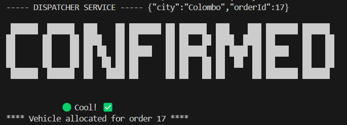
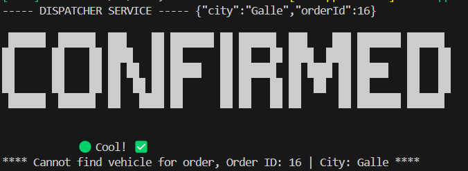
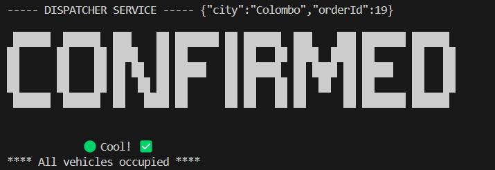

<h1 align="center">
  Bootcamp with Krish (Day 3 Assignment)
  <br>
</h1>

<hr>

<h3>
  Nest Js / MySQl Project
  <br>
</h1>

## Frontend React
* URL : http://localhost:3003
```bash
# Clone this repository
$ git clone https://github.com/Jiffry-Shuhail/codeWithKrish.git

# Go into the repository
$ cd microservices-nest/cosmos/cosmos-app

# Install dependencies
$ npm install

# Run the app
$ npm run start
```

## End Points

### Order-Service
```bash
# Clone this repository
$ git clone https://github.com/Jiffry-Shuhail/codeWithKrish.git

# Go into the repository
$ cd microservices-nest/cosmos/order-service

# Install dependencies
$ npm install

# Run the app
$ npm run start:dev
```
* Create: http://localhost:3000/orders

<h5>Sample Body JSON</h5>

```json
{
    "customerId": 1,
    "items": [
        {
            "productId": 1,
            "price": 20.0,
            "quantity": 10
        },
        {
            "productId": 2,
            "price": 5.5,
            "quantity": 1
        }
    ]
}
```

* FindById: http://localhost:3000/orders/<1>
* FindAll: http://localhost:3000/orders
* UpdateStatus: http://localhost:3000/orders/<1>/status
<h5>Sample Body JSON</h5>

```json
{
	"status":"CONFIRMED"
}
```
* UpdateStatus: http://localhost:3000/orders/<1>/cancel
<h5>Sample Body JSON</h5>

```json
{
	"status":"CANCELLED"
}
```

<hr>

## Inventory-Service
```bash
# Clone this repository
$ git clone https://github.com/Jiffry-Shuhail/codeWithKrish.git

# Go into the repository
$ cd microservices-nest/cosmos/inventory-service

# Install dependencies
$ npm install

# Run the app
$ npm run start:dev
```
* Create: http://localhost:3001/products
<h5>Sample Body JSON</h5>

```json
{
    "name": "Bat",
    "price": "22.5",
    "quantity": "12"
}
```
* FindById: http://localhost:3001/products/<1>
* FindAll: http://localhost:3001/products
* Validate: http://localhost:3001/products/<1>/validate?quantity=<23>
* Validate: http://localhost:3001/products/<1>/reduce
<h5>Sample Body JSON</h5>

```json
{
    "quantity": "12"
}
```
* Validate: http://localhost:3001/products/<1>/increase
<h5>Sample Body JSON</h5>

```json
{
    "quantity": "12"
}
```

<hr>

## Customer-Service
```bash
# Clone this repository
$ git clone https://github.com/Jiffry-Shuhail/codeWithKrish.git

# Go into the repository
$ cd microservices-nest/cosmos/customer-service

# Install dependencies
$ npm install

# Run the app
$ npm run start:dev
```
* Create: http://localhost:3002/customers
<h5>Sample Body JSON</h5>

```json
{
    "name": "Jiffry",
    "email": "shuhail1994@gmail.com",
    "address": "Colombo"
}
```
* FindById: http://localhost:3002/customers/<1>
* FindAll: http://localhost:3002/customers


## Dispatcher-service
* Create: http://localhost:3004/dispatch-locations
<h5>Sample Body JSON</h5>

```json
{
    "vehicle_number": "ASD-8888",
    "city": "Kandy"
}
```
* Create: http://localhost:3004/dispatch-locations/kandy

```bash
# Clone this repository
$ git clone https://github.com/Jiffry-Shuhail/codeWithKrish.git

# Go into the repository
$ cd microservices-nest/cosmos/dispatcher-service

# Install dependencies
$ npm install

# Run the app
$ npm run start
```





## How To Use

## Configuration

Modify the MySql settings in the `app.module.ts` file.

```typescript
@Module({
  imports: [OrdersModule,TypeOrmModule.forRoot({
    type:'mysql',
    host:'localhost', // Update Host
    port:3306, // Update Port 
    username:'root', // Update Username
    password:'******', // Add password
    database:'cosmos', // Update Schema name
    entities:[Order, OrderItem, Customer, Product],
    synchronize:true //Dont use production | only on dev
  }), CustomersModule, ProductsModule],
})
```
Create a Database.
```sql
create database cosmos;
```

To clone and run this application, you'll need [Git](https://git-scm.com) and [Node.js](https://nodejs.org/en/download/) (which comes with [npm](http://npmjs.com)) installed on your computer. From your command line:

> **Note**
> If you're using Linux Bash for Windows, [see this guide](https://www.howtogeek.com/261575/how-to-run-graphical-linux-desktop-applications-from-windows-10s-bash-shell/) or use `node` from the command prompt.

---

> [jiffryshuhail.com](https://jiffryshuhail.com/) &nbsp;&middot;&nbsp;
> GitHub [@Jifry-Shuhail](https://github.com/Jiffry-Shuhail) &nbsp;&middot;&nbsp;

